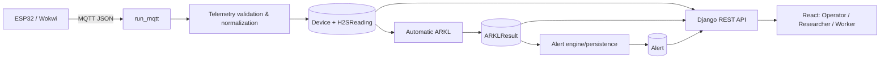
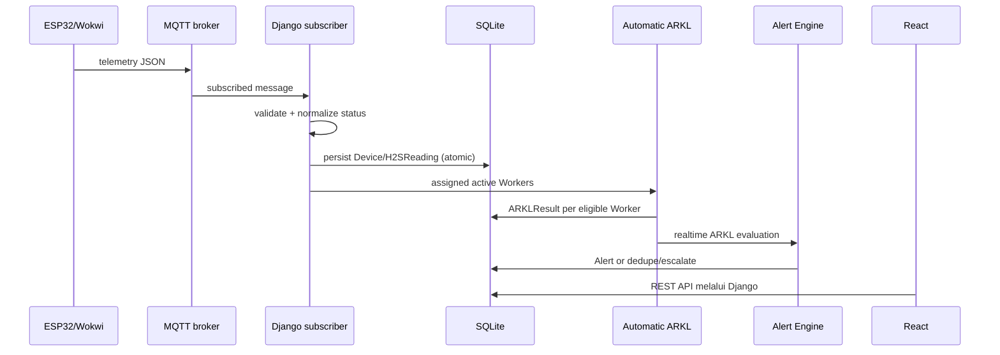
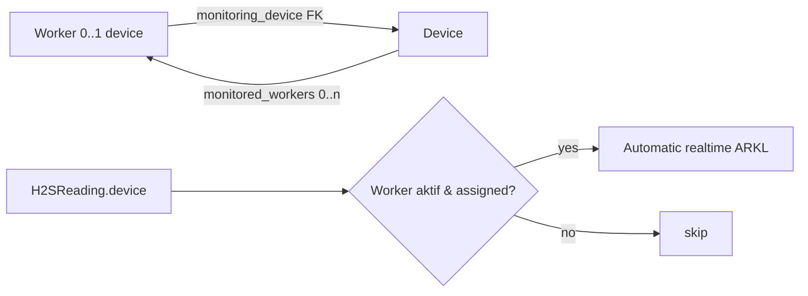
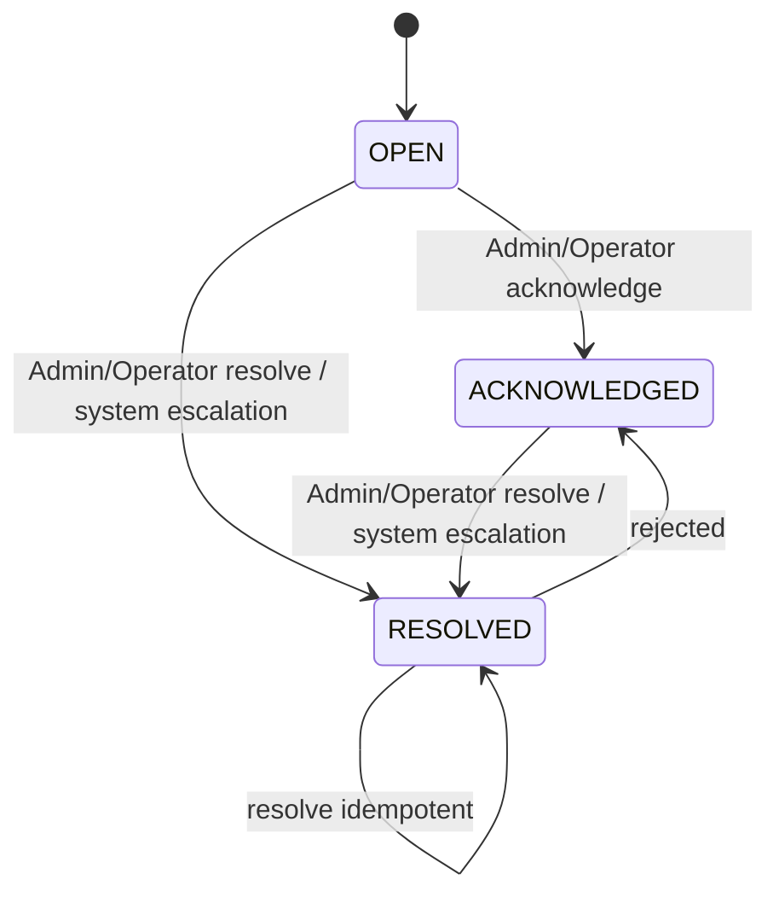
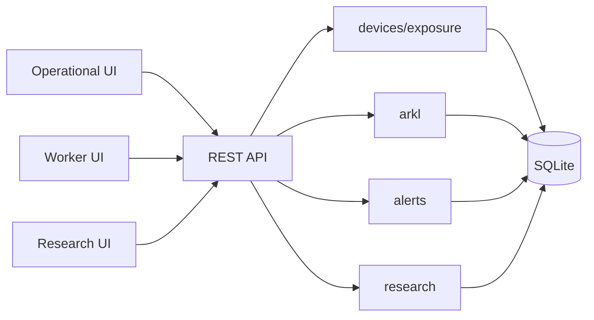

# Referensi Teknis Sistem Smart H2S

Status: source of truth teknis implementasi saat ini. Dibuat dari kode dan test yang ada, bukan dari nama berkas. Bukti diberi label **VERIFIED FROM CODE**, **VERIFIED FROM TEST**, **DOCUMENTATION ONLY**, atau **INFERENCE**.

Last Repository Audit: 2026-08-26

Source of Truth Priority:

1. Production code
2. Automated tests
3. Models/migrations
4. `SYSTEM_TECHNICAL_REFERENCE.md`
5. Legacy documentation

## How to Use This Document

Gunakan dokumen ini sebagai referensi arsitektur dan domain untuk memahami perilaku sistem yang sedang diimplementasikan. Dokumen ini bukan panduan menjalankan/deploy sistem dan bukan publikasi ilmiah; untuk perubahan operasional atau ilmiah, verifikasi kembali kode, test, dan sumber ilmiah yang berwenang.

## 1. Project Overview

Smart H2S memantau telemetri H2S, menyimpan pembacaan, mengkarakterisasi risiko inhalasi ARKL per pemulung/Worker, menghasilkan peringatan deterministik, dan menyajikan operasi, tampilan personal Worker, serta riset. **VERIFIED FROM CODE:** `devices/services/mqtt_ingestion.py`, `arkl/services/`, `alerts/services/`, `Frontend/src/`.

## 2. System Objectives

1. Menyimpan telemetri H2S tervalidasi sebagai rekam lingkungan.
2. Memisahkan kondisi lingkungan (status Device/reading) dari karakterisasi risiko personal (ARKL/RQ).
3. Menghasilkan ARKL dan Alert otomatis tanpa menjadikan UI sebagai pemicu.
4. Menegakkan akses berbasis peran dan kepemilikan data Worker.
5. Menyediakan data agregat/versioned untuk riset.

## 3. Technology Stack

| Area | Implementasi |
|---|---|
| Backend | Python, Django 5.2, Django REST Framework, drf-spectacular, Token/Session auth |
| Frontend | React 19, TypeScript, Vite 8, React Router, TanStack Query, Tailwind/shadcn, Recharts |
| IoT/MQTT | paho-mqtt v2; subscriber management command `run_mqtt`; broker/topic dikonfigurasi environment |
| Database | SQLite (`Backend/db.sqlite3`) |
| Testing | pytest/Django tests dan `feature_tests`; Vitest integration tests frontend |

**VERIFIED FROM CODE:** `Backend/requirements/base.txt`, `Backend/config/settings.py`, `Frontend/package.json`.

## 4. High-Level Architecture

**VERIFIED FROM CODE:** source listed in diagram. MQTT persistence completes before downstream processing; ARKL failure is caught and logged without rolling back the reading.

## 5. Domain / Layer Architecture

| Layer | Implementasi dan batas penting |
|---|---|
| 1 — Environmental IoT Monitoring | `Device`, `H2SReading`, MQTT validation/normalization; status adalah kondisi lingkungan. |
| 2 — Exposure Management | `Worker`, satu `ExposureProfile`, dan assignment `monitoring_device`. |
| 3 — Smart ARKL | layanan murni di `arkl/services`; snapshot hasil ke `ARKLResult`. |
| 4 — Early Warning & Risk Management | matriks environment + interpretasi RQ, rekomendasi, lifecycle `Alert`. |
| 5 — Research / Reporting | agregasi pembacaan/ARKL/Alert dan ekspor CSV; tidak menghitung ulang ARKL. |

## 6. User Roles and RBAC

| Role | Hak aktual |
|---|---|
| ADMIN | Membuat account; CRUD terbatas Device/Worker/Exposure; ARKL realtime/historical; evaluate/acknowledge/resolve Alert; membaca data operasional, hasil, dan riset. Superuser dipetakan sebagai ADMIN. |
| OPERATOR | Sama seperti ADMIN kecuali membuat account. |
| RESEARCHER | Read-only Device dan reading; generic ARKL/Alert; seluruh endpoint research. Tidak boleh Worker/Exposure generic atau mutasi operasional. |
| WORKER | Hanya endpoint `/me/` untuk Worker aktif yang tertaut: profil dan exposure dapat dipatch (field terbatas); ARKL, Alert, dan monitoring miliknya dapat dibaca. |

**VERIFIED FROM CODE:** `accounts/permissions.py`, semua `views.py`. Account WORKER wajib terhubung tepat satu Worker; role lain dilarang punya Worker link (`accounts/models.py`).

## 7. Backend Module Responsibilities

| Modul | Tanggung jawab / model / endpoint utama / dependensi |
|---|---|
| `accounts` | `AccountProfile`; login/logout/me, create account, personal Worker APIs. Menggunakan `exposure`, `devices`, `arkl`, `alerts`. |
| `devices` | `Device`, `H2SReading`; router `/devices/`, `/readings/`, `/readings/latest/`; MQTT ingestion dan telemetry. Memanggil ARKL otomatis sesudah persist. |
| `exposure` | `Worker`, `ExposureProfile`; `/workers/`, `/exposure-profiles/`; resolusi laju inhalasi menurut umur. Bergantung pada `devices.Device`. |
| `arkl` | `ARKLResult`; `/arkl/realtime/`, `/historical/`, `/results/`; kalkulator dan orkestrasi Alert. Bergantung pada reading, Worker/profile, Alert. |
| `alerts` | `Alert`; `/alerts/`, `evaluate/`, `acknowledge/`, `resolve/`; keputusan, rekomendasi, deduplikasi, lifecycle. |
| `research` | endpoint `research/*` ringkasan, trend, ARKL version-filtered, distribusi, CSV. Query terhadap `devices`, `arkl`, `alerts`, `exposure`. |
| `core` | request ID, logging, timing/performance, security audit, observability/redaction. |
| `config` | settings, URL mounting `/api/v1/`, OpenAPI `/api/schema/`, Swagger `/api/docs/`. |

## 8. Frontend Architecture

`src/api/*.ts` menjadi boundary HTTP ber-token (`api/client.ts`); token tersimpan di localStorage (fallback memori). `AppRouter.tsx` membagi route `ADMIN/OPERATOR` (`/app`), `RESEARCHER` (`/research`), dan `WORKER` (`/worker`). `ProtectedRoute` hanya mengecek token; `RoleRoute` meminta `/auth/me/`; `WorkerSetupGuard` mengarahkan Worker yang profil/exposure-nya belum lengkap ke onboarding.

Layout: `AuthLayout`, `OperationalLayout`, `ResearchLayout`, dan `WorkerLayout`. Komponen domain yang dipakai ulang mencakup `MetricCard`, `H2SHistoryChart`, `FreshnessBadge`, `RiskBadge`, `AlertLevelBadge`, `AlertStatusBadge`, serta `EmptyState`/`ErrorState`. **VERIFIED FROM CODE:** seluruh berkas di `Frontend/src/app`, `src/api`, dan `src/components/{status,data-display}`.

## 9. Feature Matrix

| Feature | User Role | Frontend Page | Backend Endpoint | Service | Model | Status |
|---|---|---|---|---|---|---|
| Telemetry live | Admin/Operator/Researcher | Dashboard, Monitoring, Device detail | `GET /readings/latest/`, `/readings/` | telemetry/ingestion | H2SReading | Ada |
| Device management | Admin/Operator | Devices, Device detail | `/devices/` | DRF viewset | Device | Ada |
| Worker/exposure | Admin/Operator | Workers, Worker detail, Exposure profile | `/workers/`, `/exposure-profiles/` | inhalation/validation | Worker, ExposureProfile | Ada |
| ARKL | Admin/Operator | ARKL, Worker detail | `/arkl/realtime/`, `/historical/`, `/results/` | calculator/realtime | ARKLResult | Ada |
| Alert lifecycle | Admin/Operator | Alerts, Alert detail | `/alerts/*` | engine/persistence/lifecycle | Alert | Ada |
| Personal view | Worker | Home, Monitoring, Risk, Alerts, Profile | `/me/*` | accounts views | Worker/profile/results/Alert | Ada |
| Research/CSV | Researcher (+ Admin/Operator API) | Research dashboard, Data ARKL | `/research/*` | research services | all aggregate sources | Ada |

## 10. Complete End-to-End Data Flow

## 11. MQTT and Telemetry Contract

Payload wajib berisi `device_id`, `ppm`, `adc`, `filtered_adc`, `level`, `status`, `uptime_ms`, `simulated`. `ppm >= 0`; ADC dan filtered ADC 0..4095; `level`/uptime tidak negatif; `simulated` boolean. Status menjadi canonical `NORMAL|CAUTION|WARNING|DANGER|CRITICAL`; alias firmware Indonesia (`AMAN`, `WASPADA`, `PERINGATAN`, `BAHAYA`, `BAHAYA TINGGI`) dinormalisasi.

Invalid JSON/tipe/field ditolak dan return `None`; kesalahan database menaikkan `MQTTIngestionError`. Device dibuat otomatis berdasar `device_id`, lalu reading selalu dipersist atomik. `on_message` menangkap error per pesan; disconnect hanya dilog. Tidak ada implementasi retry/reconnect eksplisit di command selain `loop_forever`; **Belum terverifikasi dari implementasi saat ini** apakah library melakukan reconnect otomatis. **VERIFIED FROM CODE:** `devices/services/{telemetry,mqtt_ingestion}.py`, `run_mqtt.py`.

## 12. Worker Monitoring Assignment

Invariant: satu `Worker` memiliki nol atau satu `monitoring_device` (nullable FK), sementara satu `Device` dapat memonitor banyak Worker (`related_name=monitored_workers`). Hanya Admin/Operator dapat mengatur FK melalui serializer Worker; API personal tidak mengekspos field mutasi device. Realtime ARKL menolak Worker tanpa device atau device yang berbeda. Proses otomatis mengambil Worker aktif dengan FK ke device reading, lalu mengunci row Worker dan memvalidasi ulang assignment. 

## 13. Exposure Management

`Worker`: `code`, `name`, `age`, `is_active`, `monitoring_device`, timestamps. `ExposureProfile` (one-to-one): `body_weight`, `exposure_time` jam/hari, `exposure_frequency` hari/tahun, `exposure_duration` tahun, `inhalation_rate`, timestamps.

Aturan aplikasi pada resolver saat ini: usia 6–12 mendapat kategori `CHILD_6_12` dengan `0.50 m³/jam`; usia >=18 mendapat `ADULT` dengan `0.83 m³/jam`. Dua rentang eksplisit tidak didukung: usia <6 dan usia 13–17; keduanya mencapai `UnsupportedInhalationMethodologyError`. Nilai tersebut adalah nilai referensi/metodologi laju inhalasi yang dipakai aplikasi, sedangkan batas umur adalah aturan cakupan metodologi aplikasi saat ini—bukan klaim batas biologis atau diagnosis ilmiah. Saat umur berubah, profile yang ada disinkronkan secara atomic. Validasi: berat/durasi/rate >0, waktu <=24, frekuensi <=365. **VERIFIED FROM CODE:** `exposure/models.py`, `services/{constants,inhalation,validation}.py`.

## 14. ARKL Scientific Calculation

Implementasi runtime saat ini adalah versi `2.0.0-MVP` (bukan formula EC primer yang tertulis di dokumentasi lama). Pipeline: `C(mg/m³)=ppm×1.40`; `tavg=Dt×365`; `I=(C×R×tE×fE×Dt)/(Wb×tavg)`; `RQ=I/RfC`, dengan `RfC=0.002`; `RQ<=1 => WITHIN_REFERENCE_LEVEL`, selainnya `ABOVE_REFERENCE_LEVEL`.

**CURRENT IMPLEMENTATION OBSERVATION — REQUIRES SCIENTIFIC/ARCHITECTURAL REVIEW BEFORE CHANGING:** runtime calculator menetapkan `exposure_concentration_mg_m3` menjadi `None`, sehingga field tersebut dipersist sebagai `null`; layanan `exposure_concentration.py` ada tetapi tidak diimpor/dipanggil oleh `calculator.py`. Pernyataan ini mendeskripsikan implementasi aktif, bukan instruksi mengubah metode ilmiah. **VERIFIED FROM CODE:** `arkl/services/{constants,calculator,conversion,intake,rq,interpretation,exposure_concentration}.py`.

## 15. Scientific Guardrails

ARKL adalah karakterisasi risiko kesehatan lingkungan melalui inhalasi; bukan diagnosis ISPA dan RQ bukan probabilitas penyakit. Konstanta/formula tidak boleh diubah diam-diam. Konflik terdokumentasi: `ARKL_CALCULATION_SPEC.md` menyatakan v1.1/EC sebagai primary dan `PROJECT_STATUS.md` perlu dianggap sekunder; kode runtime memakai intake v2 seperti di atas. **VERIFIED FROM CODE + DOCUMENTATION ONLY (untuk konflik).**

## 16. Automatic ARKL Processing Policy

Per Worker active assigned: reading pertama diproses; reading dengan `received_at <=` reading hasil terakhir di-skip; perubahan status diproses segera; status sama diproses bila jarak >=60 detik; lainnya skip. Hasil terbaru ditentukan berdasarkan `reading.received_at`, lalu id. Setiap Worker diproses dalam transaksi dan `select_for_update`; kegagalan `RealtimeARKLError` satu Worker dilog dan tidak menghentikan Worker lain. **VERIFIED FROM CODE:** `arkl/services/automatic.py`.

## 17. Realtime vs Historical ARKL

| Aspek | REALTIME | HISTORICAL |
|---|---|---|
| Data | latest device (API) atau exact persisted reading (MQTT) | mean aritmetika readings periode inklusif |
| Assignment | wajib device Worker saat ini | tidak wajib assignment saat ini |
| Persist | reading FK terisi | reading `null`, period + count terisi |
| Alert | dievaluasi oleh workflow realtime | tidak membuat alert |
| API | Admin/Operator POST | Admin/Operator POST |

## 18. Alert Engine

| Environment \ RQ | WITHIN_REFERENCE_LEVEL | ABOVE_REFERENCE_LEVEL |
|---|---|---|
| NORMAL | NONE | MEDIUM |
| CAUTION | LOW | MEDIUM |
| WARNING | MEDIUM | HIGH |
| DANGER | HIGH | CRITICAL |
| CRITICAL | CRITICAL | CRITICAL |

Risk status: NONE=`NO_ACTION_REQUIRED`; LOW/MEDIUM=`MONITORING_REQUIRED`; HIGH=`RISK_MANAGEMENT_REQUIRED`; CRITICAL=`IMMEDIATE_ACTION_REQUIRED`. **VERIFIED FROM CODE:** `alerts/services/alert_engine.py`.

## 19. Alert Persistence & Deduplication

Aktif berarti `OPEN` atau `ACKNOWLEDGED`, per pasangan Worker+Device. `NONE` tidak membuat maupun auto-resolve alert aktif. Level sama mengembalikan alert aktif sebagai duplicate. Level lebih rendah mempertahankan alert aktif. Level lebih tinggi resolve alert lama oleh sistem lalu membuat snapshot OPEN baru. **VERIFIED FROM CODE:** `alerts/services/{deduplication,persistence,lifecycle}.py`.

## 20. Alert Lifecycle

ACK/resolve menyimpan timestamp dan actor bila manual; supersede sistem tidak memiliki `resolved_by`. **VERIFIED FROM CODE:** `alerts/views.py`, `lifecycle.py`.

## 21. Recommendation Engine

Kode deterministik: `MONITOR_H2S_LEVEL`, `INCREASE_MONITORING_FREQUENCY`, `REDUCE_EXPOSURE_DURATION`, `LIMIT_ACCESS_TO_EXPOSURE_AREA`, `TEMPORARY_AREA_AVOIDANCE`, `USE_APPROPRIATE_PPE`, `NOTIFY_RESPONSIBLE_OPERATOR`, `PERFORM_FURTHER_RISK_EVALUATION`. NONE kosong; pemetaan persis berada di `alerts/services/recommendation.py`.

## 22. Research Module

H2S summary (count/min/max/avg/waktu/provenance/device), trend raw/hour/day, ARKL result yang difilter `calculation_version`, risk distribution, exposure average, alert summary, dan CSV ARKL tersedia. `reporting.py` dan `statistics.py` kosong, sehingga reporting/statistics tambahan **Belum terverifikasi dari implementasi saat ini**. Semua research read-only dan tidak paginasi. 

## 23. Frontend Operational Behavior

Dashboard menggabungkan latest H2S, REALTIME ARKL yang sudah tersimpan, serta Alert OPEN/ACKNOWLEDGED. Monitoring menampilkan latest/history device; Devices dan detail membuat/mengubah Device (tanpa delete); Workers/detail membuat/mengubah Worker, assignment, dan exposure; Alerts/detail membaca serta ACK/resolve. Semua memakai API module; error ditampilkan state UI dan mutation invalidates query terkait.

`ARKLPage` saat ini adalah halaman observasi read-only: ia meminta Worker, Device, lalu `getLatestRealtimeARKL()` (GET `/arkl/results/?calculation_type=REALTIME`) untuk Worker terpilih. Halaman ini tidak mengimpor atau memanggil `calculateRealtimeARKL()` maupun `calculateHistoricalARKL()`. Dalam operasi IoT normal, MQTT/backend mempersist reading lalu menjalankan automatic ARKL; UI hanya melihat snapshot tersebut. `calculateRealtimeARKL()` tetap tersedia di `src/api/arkl.ts` sebagai jalur API compatibility/debug dan dipakai test integration explicit realtime, bukan trigger frontend produksi normal. Workflow HISTORICAL tetap tersedia pada backend/API (`POST /arkl/historical/`), tetapi tidak memiliki pemicu di `ARKLPage` saat ini. **VERIFIED FROM CODE/TEST:** `Frontend/src/pages/operational/ARKLPage.tsx`, `Frontend/src/api/arkl.ts`, `full-risk-flow.integration.test.ts`, `alert-lifecycle.integration.test.ts`, dan `devices/services/mqtt_ingestion.py`.

## 24. Worker Frontend Behavior

Monitoring H2S = kondisi lingkungan saat ini dari device assigned (`/me/monitoring/`), bukan risiko pribadi. Risk Saya = riwayat karakterisasi exposure personal (`/me/arkl-results/`). Peringatan = state warning/action personal (`/me/alerts/`). Tidak adanya alert aktif tidak membuktikan lingkungan aman: bisa matriks NONE, belum ada ARKL, assignment/profile tidak siap, atau status lifecycle berubah. Onboarding/profile/exposure dapat memperbarui data personal yang diizinkan. **VERIFIED FROM CODE:** `Frontend/src/pages/worker/`, accounts personal APIs.

## 25. Research Frontend Behavior

`ResearchDashboardPage` meminta summary H2S, distribution risiko, exposure summary, Alert summary, dan komponen trend. `ResearchARKLPage` membaca hasil ARKL yang sudah dipersist serta mengekspor CSV; tidak menghitung ulang ARKL. Route UI hanya RESEARCHER, meski backend mengizinkan Admin/Operator read-only research. **VERIFIED FROM CODE:** `Frontend/src/pages/research/`.

## 26. Frontend Polling Strategy

Interval `refetchInterval` yang saat ini benar-benar diimplementasikan:

| Page / query | Interval | Catatan |
|---|---:|---|
| Operational `DashboardPage`: latest reading | 5 s | `staleTime` 2 s |
| Operational `DashboardPage`: REALTIME ARKL, Alert OPEN, Alert ACKNOWLEDGED | masing-masing 10 s | `staleTime` 5 s |
| Operational `MonitoringPage`: latest reading dan reading list | masing-masing 5 s | keduanya `refetchIntervalInBackground: true` |
| Operational `DeviceDetailPage`: latest reading dan history reading | masing-masing 5 s | hanya saat device code tersedia |
| Operational `ARKLPage`: Worker list dan Device list | masing-masing 30 s | `staleTime` 30 s |
| Operational `ARKLPage`: latest REALTIME ARKL Worker terpilih | 10 s | `staleTime` 5 s |
| Worker `WorkerHomePage`: monitoring | 5 s | `staleTime` 4 s |
| Worker `WorkerHomePage`: ARKL results dan Alert | masing-masing 15 s | |
| Worker `WorkerMonitoringPage`: monitoring | 5 s | `staleTime` 4 s |
| Worker `WorkerRiskPage`: ARKL results | 15 s | |
| Worker `WorkerAlertsPage` dan `WorkerAlertDetailPage`: Alert | masing-masing 15 s | |

Tidak ditemukan `refetchInterval` pada halaman operational lain atau halaman research saat audit ini. Polling hanya mengobservasi state backend; operasi IoT normal dipicu MQTT sesudah persistence, bukan React. **VERIFIED FROM CODE:** seluruh `refetchInterval` pada `Frontend/src/pages/operational/` dan `Frontend/src/pages/worker/`.

## 27. API Contract Summary

Base API: `/api/v1/`.

| Group | Method | Path | Role | Purpose |
|---|---|---|---|---|
| Authentication | POST | `/auth/login/`, `/auth/logout/` | public / authenticated | token login, revoke token |
| Authentication | GET | `/auth/me/` | all application roles | identity/role |
| Accounts | POST | `/accounts/` | Admin | create account |
| Devices | GET/POST/PATCH | `/devices/`, `/{id}/` | A/O write; R read | device |
| Devices | GET | `/readings/`, `/{id}/`, `/latest/` | A/O/R | H2S read |
| Workers | GET/POST/PATCH | `/workers/`, `/{id}/` | A/O | worker |
| Exposure | GET/POST/PATCH | `/exposure-profiles/`, `/{id}/` | A/O | profile |
| ARKL | POST | `/arkl/realtime/`, `/historical/` | A/O | calculate |
| ARKL | GET | `/arkl/results/`, `/{id}/` | A/O/R | result |
| Alerts | GET | `/alerts/`, `/{id}/` | A/O/R | Alert view |
| Alerts | POST/PATCH | `/alerts/evaluate/`, `/{id}/acknowledge/`, `/{id}/resolve/` | A/O | evaluation/lifecycle |
| Personal Worker | GET/PATCH | `/me/profile/`, `/me/exposure/` | linked active Worker | own editable data |
| Personal Worker | GET | `/me/monitoring/`, `/me/arkl-results/`, `/me/alerts/` | linked active Worker | own data |
| Research | GET | `/research/h2s-summary/`, `/h2s-trends/`, `/arkl-results/`, `/risk-distribution/`, `/exposure-summary/`, `/alert-summary/`, `/export/arkl.csv` | A/O/R | analysis/export |

All paths have trailing slash except `/research/export/arkl.csv`. **VERIFIED FROM CODE:** all app `urls.py`.

## 28. Error Handling

Serializer/domain validation menghasilkan DRF 400; missing device/profile/reading dan inactive Worker/Device menghasilkan 400 untuk ARKL; personal missing profile/device menghasilkan 404, link Worker inactive/missing 403. MQTT pesan invalid ditolak tanpa persist; downstream ARKL error diisolasi sesudah persistence. UI memakai loading/error/empty states dan guard memperlakukan 404 Exposure sebagai state onboarding. **VERIFIED FROM CODE.**

## 29. Observability

`RequestIDMiddleware` menerima/generate `X-Request-ID`, menaruh context, dan mengembalikan header. Request logging mencatat mulai/selesai/gagal; performance mengembalikan `X-Response-Time-ms` dan warning >=500 ms; security audit mencatat 400/401/403. Logging memakai rotating files. `redact_mapping` menyamarkan password/token/authorization/cookie/secret/api_key, tetapi penggunaannya pada jalur log ini **Belum terverifikasi dari implementasi saat ini**. 

## 30. Testing Architecture

Backend memiliki unit kalkulator/validation/model/service, API tests, Alert E2E, MQTT automatic ARKL (`devices/tests/test_mqtt_automatic_arkl.py`), core middleware tests, dan `feature_tests` skenario Worker. Frontend Vitest integration mencakup backend/auth, RBAC, operator, researcher, worker, full risk flow, Alert lifecycle, dan live IoT flow. **VERIFIED FROM TEST:** folder test yang ada.

## 31. Integration Fixture Architecture

Deterministik: `seed_integration_users` membuat/memastikan `integration_operator`, `integration_researcher`, `integration_worker`, Worker `PML-INTEGRATION-001`, satu `ExposureProfile`, dan password dari environment. Command ini tidak membuat atau meng-assign monitoring Device. `seed_integration_scenario` membuat/memastikan Device `H2S-INTEGRATION-001` dan selalu menambah satu reading `WARNING` simulasi 25.4 ppm; command ini tidak membuat Worker dan tidak meng-assign Device kepada Worker. Karena realtime ARKL menegakkan assignment, hubungan `PML-INTEGRATION-001 → H2S-INTEGRATION-001` dapat memerlukan setup manual/eksternal sebelum test explicit realtime/lifecycle berjalan; kedua command sendiri tidak membuktikannya.

Live: `live-iot-flow.integration.test.ts` mengharapkan credential `integration_live_worker` dan Device dari `TEST_LIVE_DEVICE_CODE` (komentar test menyebut Device live `H2S-TPA-001`), serta Worker aktif yang telah tertaut dan assigned ke Device tersebut. Tidak ada management command saat ini yang membuat `integration_live_worker`, `PML-LIVE-001`, `H2S-TPA-001`, atau assignment live tersebut; semuanya memerlukan setup manual/eksternal dan Wokwi/MQTT aktif. Fixture deterministic dan live tidak boleh dicampur karena live stream mengubah observasi. **VERIFIED FROM TEST/CODE:** `accounts/management/commands/seed_integration_users.py`, `devices/management/commands/seed_integration_scenario.py`, `Frontend/src/tests/integration/{env,full-risk-flow.integration.test.ts,alert-lifecycle.integration.test.ts,live-iot-flow.integration.test.ts}`.

## 32. Current Test Baseline

| Command | Result | Last verified date |
|---|---|---|
| `cd Backend && pytest` | Numeric result externally verified/pending update; repository artifacts yang diaudit tidak membuktikan count runtime. | Belum terverifikasi pada audit ini (2026-08-26) |
| `cd Frontend && npm run test:integration` | Numeric result externally verified/pending update; memerlukan backend, credential `.env.integration`, dan untuk live test MQTT/Wokwi. | Belum terverifikasi pada audit ini (2026-08-26) |

Daftar suite diverifikasi dari repository, tetapi tidak ada angka pass yang diinventasikan. **VERIFIED FROM TEST** untuk keberadaan suite; result numerik **Belum terverifikasi dari implementasi saat ini**.

## 33. Current Constraints / Technical Debt

- SQLite dipakai; `select_for_update` ada pada workflow kritis, namun keterbatasan concurrency SQLite perlu diperhatikan. **INFERENCE dari konfigurasi/kode.**
- Raw `H2SReading` tumbuh tanpa retensi/arsip yang terlihat. **VERIFIED FROM CODE** (model/ingestion; tidak ada retention service ditemukan).
- UI menggunakan polling, bukan WebSocket/SSE. **VERIFIED FROM CODE.**
- Usia 13–17 tidak didukung metodologi inhalasi. **VERIFIED FROM CODE.**
- Schema OpenAPI kemungkinan drift: API accounts ada di URL/code sedangkan dokumentasi sekunder menyebut schema belum memuatnya. **DOCUMENTATION ONLY** untuk status schema drift.

## 34. Completed Capabilities

MQTT ingestion tervalidasi, persistence telemetry, assignment Worker, ARKL realtime/historical versioned, Alert matrix/lifecycle, RBAC/personal APIs, research aggregation/CSV, dan halaman React per peran tersedia. **VERIFIED FROM CODE.**

## 35. Remaining / Planned Capabilities

Tidak ada roadmap implementasi yang dapat dipastikan dari kode aktif. `research/services/reporting.py` dan `statistics.py` kosong; berarti fungsi tambahan pada dua area itu belum ada, bukan janji roadmap. **VERIFIED FROM CODE.**

## 36. Rules for Future Development

- Pertahankan kalkulasi ilmiah deterministik; jangan gunakan AI/LLM untuk mengganti formula.
- Jangan ubah konstanta/formula ilmiah secara diam-diam; version-kan perubahan.
- Persist telemetry valid sebelum proses risiko hilir; kegagalan ARKL/Alert tidak boleh rollback raw telemetry.
- Jangan hitung realtime ARKL pada setiap paket MQTT; pertahankan policy status/60 detik.
- Jangan hapus ownership `Worker.monitoring_device`, revalidasi assignment, atau mengizinkan Worker memilih device arbitrer.
- Polling frontend hanya observer, bukan trigger ARKL.
- Jangan menganggap tidak ada Alert sebagai bukti aman.
- Pisahkan fixture deterministic dan live MQTT; pertahankan RBAC.
- Terapkan SOLID/KISS/YAGNI dan hindari infrastruktur yang belum diperlukan.

## Frontend–Backend Domain Flow

### Source Files Referenced

Primary implementation: `Backend/config/{settings,urls}.py`; all `models.py`, `serializers.py`, `views.py`, `urls.py` in `accounts`, `devices`, `exposure`, `arkl`, `alerts`, `research`; services under those modules; `Backend/core/{middleware,observability}`; `Frontend/src/App.tsx`, routing/guards/layouts/API/pages/components, and tests named in section 30. No environment secret is reproduced here.
